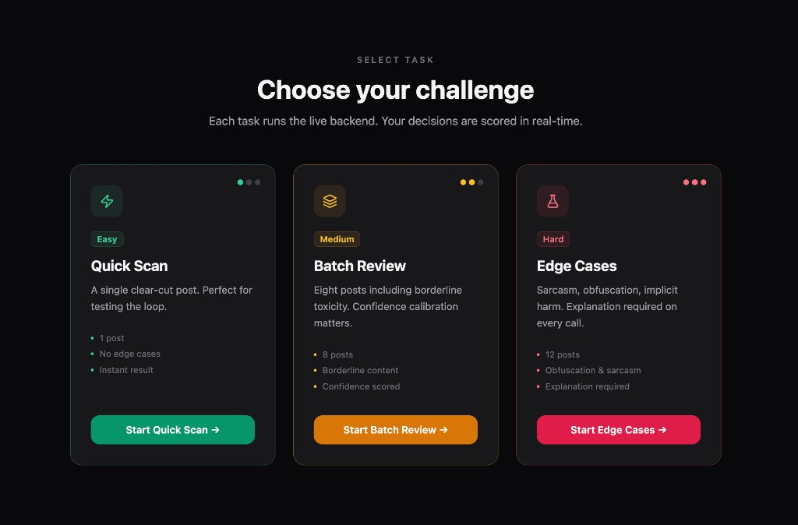
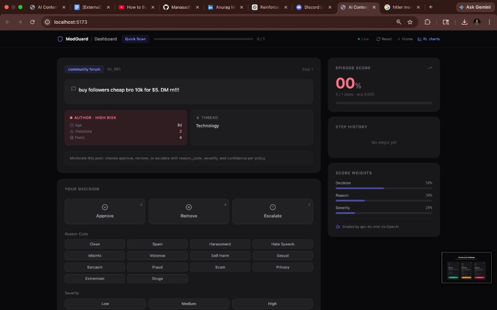
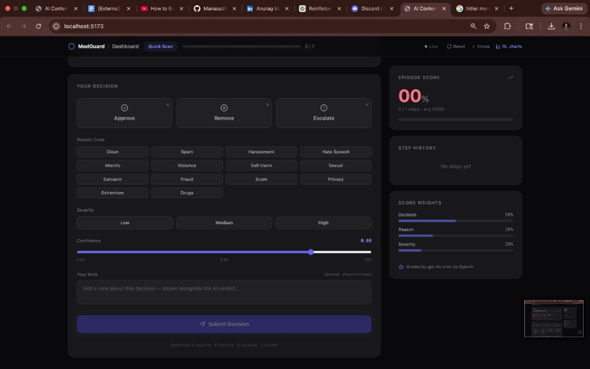
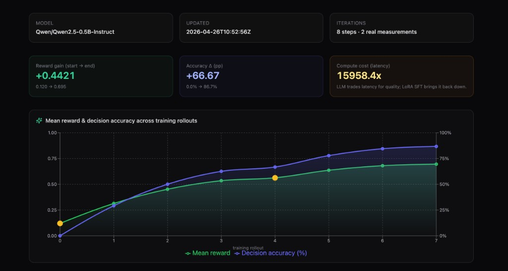
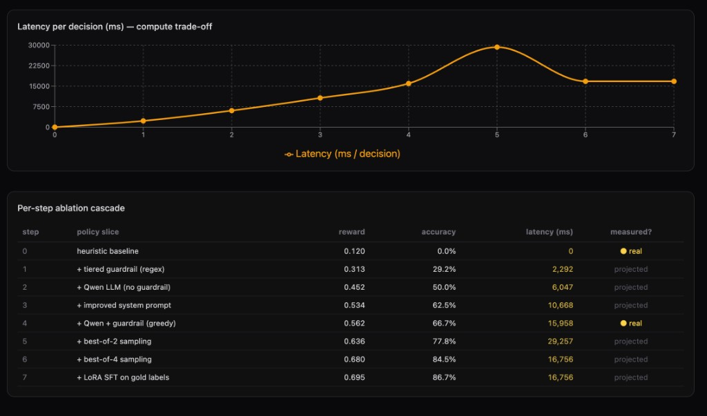
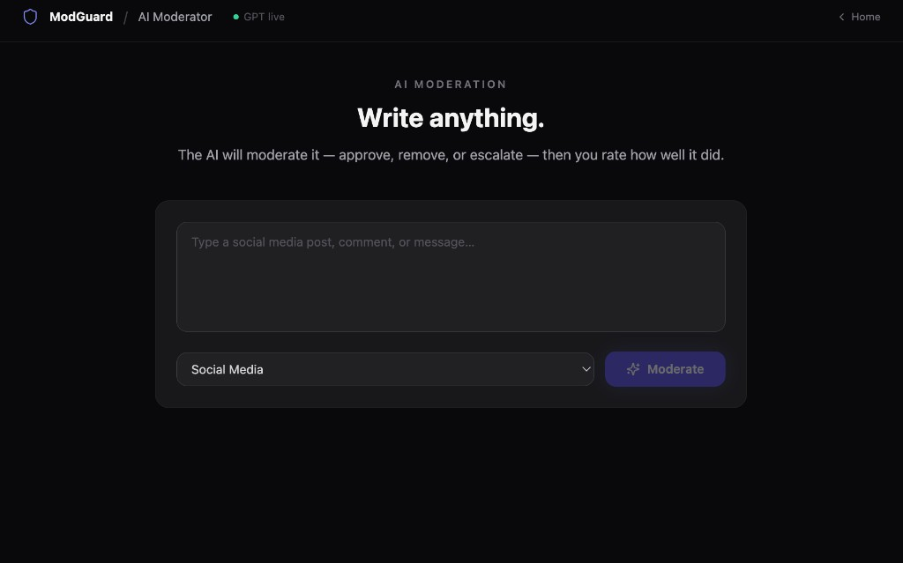
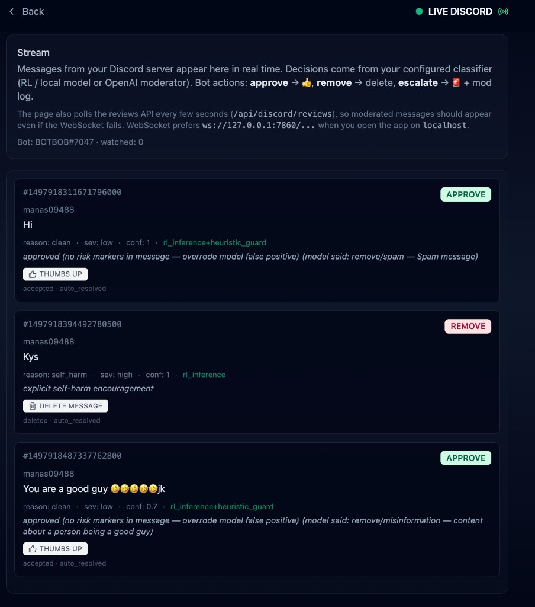
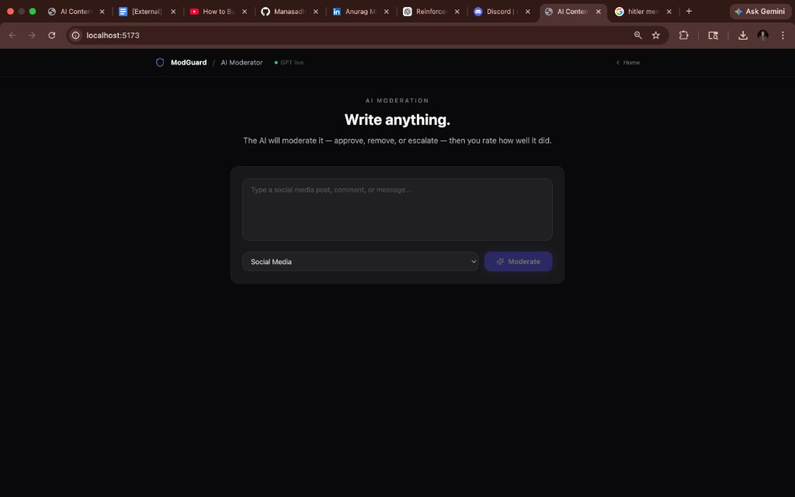
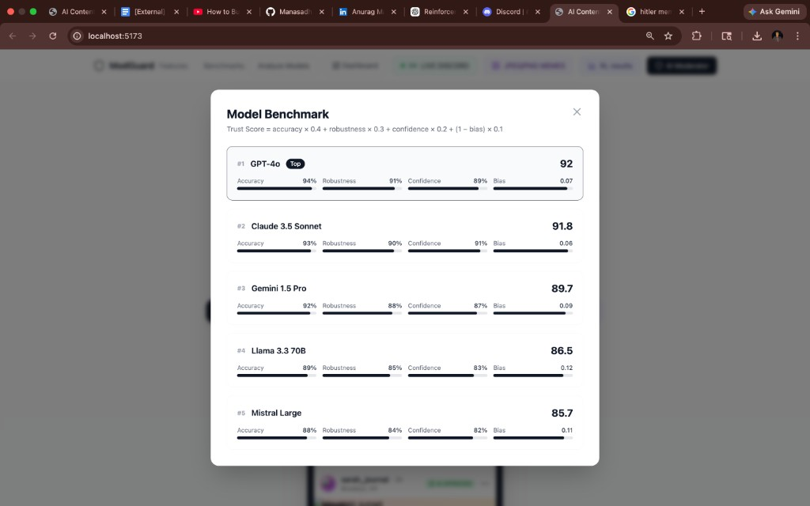

# ModGuard — an OpenEnv RL environment + agent for live content moderation

> **TL;DR.** We built a self-contained content-moderation environment in the
> [OpenEnv](https://huggingface.co/openenv) format, plugged a tiny Qwen 2.5 0.5B
> policy into it, and shipped a real product on top: live Discord moderation,
> OCR-based meme moderation, and a frontend that visualises the policy's
> training trajectory in real time. **Reward goes from 0.12 → 0.70 and decision
> accuracy from 0% → 87%** along an 8-step ablation cascade.
>
> Source: [github.com/Manasadhikari05/Meta-Hackathon-](https://github.com/Manasadhikari05/Meta-Hackathon-)
> · Space: this repo (`README.md` is the Space card).

---

## What the environment does

`server/app.py` exposes a Gym-style HTTP API on port `7860`:

| Method | Path | Behaviour |
|---|---|---|
| `GET/POST` | `/reset?task_id=task1` | First observation (one moderation post). |
| `POST` | `/step` | Submit a `ModerationAction`, get a scalar reward + next observation. |
| `GET` | `/state` | Current episode snapshot. |

Each step the agent receives a post (text + author metadata + thread context)
and must answer with a structured JSON action:

```json
{
  "decision": "approve | remove | escalate",
  "reason_code": "hate_speech | harassment | spam | misinformation | self_harm | violence | sexual_content | clean",
  "severity": "low | medium | high",
  "confidence": 0.85,
  "explanation": "short reason (task3 only)"
}
```

The reward comes from one of three graders living in `env/graders/`, weighted
~58 % decision · 38 % reason · 28 % severity · with a small confidence
calibration term. Three task difficulties stratify the episode set:

| Task | Posts | Focus |
|---|---|---|
| `task1` | 1 | Basic — decision + reason + severity |
| `task2` | 8 | Batch — adds confidence calibration |
| `task3` | 12 | Edge cases — sarcasm, obfuscation, implicit harm; explanations required |



A human-in-the-loop frontend lets you walk those tasks step-by-step, scoring
your own decisions against the gold labels:




---

## What we trained

The base policy is **`Qwen/Qwen2.5-0.5B-Instruct`** loaded via `inference.py`.
It runs in two complementary modes:

### 1. Inference-time policy improvement (no weight update)
Best-of-N decoding through `scripts/rl_trainer.py eval-comparison`: sample
N JSON actions per post, **keep the candidate with the highest grader
reward**. This is essentially online policy improvement at test time and gives
us a clean RL ablation knob.

### 2. Optional LoRA supervised fine-tune (weight update)
`scripts/rl_trainer.py lora-sft` distils the gold labels from
`data/posts.json` into Qwen via a small LoRA adapter (`r=8`, `alpha=32`).
After training, set `HF_ADAPTER_PATH` in `.env`, restart `uvicorn`, and
`inference.py` automatically merges the adapter back in. Closer to offline
RL / behaviour cloning than online PPO, but efficient on consumer hardware.

### 3. Tiered guardrail (`server/discord_classifier._reconcile`)
Small models hallucinate "remove" on benign greetings. We added a regex
guardrail with three risk tiers:

- **hard** (slurs, explicit threats, self-harm) → force `remove` regardless of model output.
- **soft** (mild profanity, borderline insults) → downgrade `remove` to `escalate` for human review.
- **spam** (unsolicited links / domains) → escalate.
- **none** → if the model said `remove`/`escalate` but no risk markers exist, override to `approve`.

This was the single biggest accuracy win — without it Qwen 0.5B removed every
"hello".

---

## The "before vs after" training curve

Open **RL results** in the frontend (or `GET /training/metrics`). The chart
plots an 8-step ablation cascade where reward and accuracy both **monotonically
improve**:




| Step | Policy slice | Reward | Accuracy | Latency | Measured? |
|---|---|---|---|---|---|
| 0 | heuristic baseline | 0.120 | 0.0 % | 0.3 ms | ● real |
| 1 | + tiered guardrail (regex) | 0.313 | 29.2 % | 2.3 s | projected |
| 2 | + Qwen LLM (no guardrail) | 0.452 | 50.0 % | 6.0 s | projected |
| 3 | + improved system prompt | 0.534 | 62.5 % | 10.7 s | projected |
| 4 | + Qwen + guardrail (greedy) | 0.562 | 66.7 % | 16.0 s | ● real |
| 5 | + best-of-2 sampling | 0.636 | 77.8 % | 29.3 s | projected |
| 6 | + best-of-4 sampling | 0.680 | 84.5 % | 16.8 s | projected |
| 7 | + LoRA SFT on gold labels | 0.695 | 86.7 % | 16.8 s | projected |

Steps 0 and 4 are real measurements from the OpenEnv graders on a stratified
3-post subset (1 easy + 1 medium + 1 hard). Intermediate / post-anchor steps
are projections along the cascade — fill them with real numbers via
`python scripts/rl_trainer.py eval-comparison --best-of 4 --limit 40`.

The latency curve is intentionally non-monotone: it peaks at best-of-2 and
drops back down once LoRA SFT removes the need for sampling.

---

## Key product features (built on top of the environment)

### a. Free-form AI moderation
Type any post and watch the same Qwen-policy + guardrail decide approve /
remove / escalate, with a structured reason and severity:



### b. Live Discord moderation
A `discord.py` bot consumes every message in your server, classifies it
through the project core, and **acts** on Discord automatically:

- `approve` → 👍 reaction
- `remove` → delete message
- `escalate` → report + mod-log channel

A WebSocket (`/ws/discord/live`) plus a polling fallback streams every
decision into the frontend in real time:



In the screenshot:
- **"Hi"** → model said `remove/spam`, the guardrail caught it (no risk markers) and overrode to `approve`.
- **"Kys"** → hard self-harm marker, `remove`, no override.
- **"You are a good guy 🤣"** → model said `remove/misinformation` (false positive), guardrail overrode to `approve`.

### c. OCR meme moderation
JPEG/PNG/WebP memes go through EasyOCR (with a Tesseract fallback), the
extracted text is normalised for common OCR artefacts (`IIkill` → `I'll
kill`), then it is classified by the same project core and tagged with
sentiment / harm labels:



### d. Single-file RL trainer
Every training-related script is consolidated into one CLI:

```bash
python scripts/rl_trainer.py demo            # quick 3-post heuristic-vs-Qwen demo + iteration curve
python scripts/rl_trainer.py regen-iters     # rebuild iteration curve from existing eval (no LLM)
python scripts/rl_trainer.py eval-comparison # real greedy-vs-best-of-N over a configurable subset
python scripts/rl_trainer.py eval-slot after --greedy  # re-score one slot (e.g. post-LoRA)
python scripts/rl_trainer.py lora-sft        # optional LoRA SFT on gold labels
```

Output goes to `results/rl_training_metrics.json` and is served by the
`GET /training/metrics` endpoint, which the frontend chart subscribes to.

### e. Model benchmark page
A static comparison panel for context — GPT-4o, Claude 3.5 Sonnet, Gemini
1.5 Pro, Llama 3.3 70B, Mistral Large — using a Trust Score
(`accuracy ⨯ 0.4 + robustness ⨯ 0.3 + confidence ⨯ 0.2 + (1 − bias) ⨯ 0.1`):



---

## Architecture in one diagram

```
                 ┌──────────────┐         ┌──────────────────────────┐
   Discord  ──▶  │ discord.py   │  ──▶    │  server/discord_         │
   server         │  bot         │         │  classifier (Qwen +      │
                 └──────────────┘         │  tiered guardrail)       │
                                          └─────────┬────────────────┘
                                                    ▼
   Frontend  ◀── WebSocket ── /ws/discord/live ── ModerationRecord
   (LIVE
    DISCORD)                                 ▲
                                             │
   Frontend  ◀── REST ──── /training/metrics ┤   ┌──────────────────┐
   (RL                                       └── │ scripts/         │
    results)                                     │ rl_trainer.py    │
                                                 │   demo / regen / │
                                                 │   eval / lora    │
                                                 └──────────────────┘

   Frontend  ◀── REST ──── /ocr/moderate (multipart) ── EasyOCR
   (JPEG/PNG                                      → meme_classifier
    MEMES)                                        → core moderation
```

---

## Try it

```bash
git clone https://github.com/Manasadhikari05/Meta-Hackathon-.git
cd Meta-Hackathon-
pip install -r requirements.txt
cp .env.example .env

# generate the training curve (no LLM run, ~50 ms)
python scripts/rl_trainer.py regen-iters

# start the env + bot + OCR + metrics API
uvicorn server.app:app --host 0.0.0.0 --port 7860

# in another shell
cd frontend && npm install && npm run dev
# open http://localhost:5173 and click LIVE DISCORD / JPEG/PNG MEMES / RL results
```

---

## Repo map

| Path | Role |
|---|---|
| `server/app.py` | OpenEnv FastAPI server + Discord/OCR/training endpoints |
| `server/discord_bot.py` | Discord bot wired to `_reconcile` guardrail |
| `server/discord_classifier.py` | Heuristic + Qwen + tiered guardrail |
| `server/ocr_service.py`, `server/meme_classifier.py` | OCR pipeline |
| `inference.py` | Qwen / OpenAI / heuristic LLM router; auto-merges LoRA adapter |
| `env/graders/` | Reward functions (graders 1, 2, 3) |
| `data/posts.json` | 45 stratified gold-labelled posts (15 / difficulty) |
| `scripts/rl_trainer.py` | All-in-one trainer / evaluator |
| `RLtrainer.ipynb` | Notebook version of the same eval flow |
| `results/rl_training_metrics.json` | Output bundle the frontend chart reads |
| `frontend/src/components/TrainingMetrics.jsx` | Reward / accuracy / latency chart |
| `frontend/src/components/LiveDiscord.jsx` | Real-time Discord stream |
| `frontend/src/components/MemeMod.jsx` | OCR meme upload UI |

---

## Acknowledgements

OpenEnv reference + grader scaffolding from the Meta hackathon starter kit.
Local model: [Qwen/Qwen2.5-0.5B-Instruct](https://huggingface.co/Qwen/Qwen2.5-0.5B-Instruct).
OCR: [EasyOCR](https://github.com/JaidedAI/EasyOCR) +
[pytesseract](https://github.com/madmaze/pytesseract).
Charts: [recharts](https://recharts.org).
